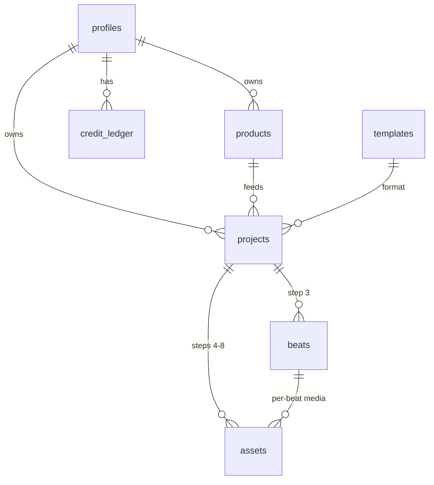

# DATA-MODEL — the frozen contract

> The central object that all 3 workstreams build against. If you change a
> column, update this file in the same PR. See [TEAM-PLAN.md](TEAM-PLAN.md) for
> why this exists and [PROJECT.md](PROJECT.md) for the 8-step workflow it backs.

Migrations live in [`supabase/migrations/`](../supabase/migrations/):

| File | Purpose |
|---|---|
| `20260626103000_core_schema.sql` | Extensions, enums, tables, indexes, triggers |
| `20260626103001_rls_storage.sql` | RLS policies + `media` storage bucket |
| `20260626103002_seed_templates.sql` | Seed the 5 viral formats (idempotent) |
| `20260626103003_advisor_fixes.sql` | Drop orphaned `set_updated_at`, lock down `handle_new_user` |
| `20260626110000_credits_fn.sql` | `public.charge_credits(user, delta, reason, project)` — atomic charge + ledger insert |

## Credits

Pay-as-you-go: every AI/vendor call charges the user **after** it returns
usable data. Costs live in `dashboard/lib/credits.ts → COST` and are roughly
anchored to **1 credit ≈ $0.01** of vendor spend:

| Action | Credits | Reason string |
|---|---|---|
| Apify product scrape | 5 | `scrape` |
| Gemini brief inference | 2 | `brief_inference` |
| Gemini script + beats | 8 | `script` |
| Gemini image (per beat) | 15 | `image:<idx>` |
| ElevenLabs voiceover (per beat) | 10 | `voiceover:<idx>` |
| Replicate Kling 2.1 clip | 40 | `clip:replicate-kling` |
| Replicate LTX-Video clip | 10 | `clip:replicate-ltx` |
| Google Veo 3 Fast clip | 200 | `clip:google-veo` |

A typical 5-beat Kling video burns:
`5 (scrape) + 2 (brief) + 8 (script) + 75 (5×img) + 50 (5×voice) + 200 (5×clip) ≈ 340 credits`.
Signup grant = **1000 credits** (see `20260626130000_credit_topup.sql`).

Legacy cost shape — `hook = 1`, `full = 3` — has been removed.
| Hook (one beat run) | 1 |
| Full ad             | 3 |

Charging is a single SQL function — `charge_credits(p_user, p_delta, p_reason, p_project)`
— so the balance update + ledger insert happen in one transaction. Negative
`p_delta` debits; positive refunds. Raises `insufficient_credits` (SQLSTATE
`P0001`) when the balance would go below zero, which `chargeCredits` surfaces
as a JS error `"insufficient_credits"`.

Only the `service_role` may call it (revoked from `anon` + `authenticated`);
server actions go through `dashboard/lib/credits.ts → chargeCredits`.
Charging points: `scrapeAndAttach` (scrape + brief), `generateScriptForProject`
(script), `generateBeatImages` (per image), `generateVoiceover` (voice),
`generateMotionClips` (per clip, provider-priced via `costForClip`).

## ER overview



## Tables

| Table | What it is | Owner column |
|---|---|---|
| `profiles` | 1:1 with `auth.users`, holds `credits` balance. Auto-created by `handle_new_user` trigger. | `id = auth.uid()` |
| `credit_ledger` | Append-only credit transactions. Write only via `service_role`. | `user_id` |
| `templates` | Viral formats (Skeleton AI, Cartoon, 3D CGI...). Public read. | — |
| `products` | Scraped product (URL / screenshot / manual). Reusable across projects. | `user_id` |
| `projects` | The draft/central object walking the 8 steps. Holds brief + script. | `user_id` |
| `beats` | Step 3 beat breakdown of a project. `unique(project_id, idx)`. | via project |
| `assets` | Every generated media + its async job status (images / voice / clips / final). | via project |

### `assets` doubles as the job table

`assets.status` (`pending` → `processing` → `ready` | `failed`) + `attempts` + `error`
gives us per-asset async tracking without a separate `jobs` table.
`ponytail:` ceiling — single row per output, no queue, no retry policy. Upgrade
path = dedicated `jobs` table when we add real queues or scheduled retries.

## Lifecycles

```text
projects.status:   draft -> generating -> ready
                                       \-> failed
                            (any state) -> archived

projects.current_step: 1 .. 8           (used to resume drafts)

job_status (products.scrape_status, assets.status):
  pending -> processing -> ready
                        \-> failed
```

## Per-step read/write map

| Step | Reads | Writes |
|---|---|---|
| 1 Template | `templates` | `projects.template_id`, `media_type` |
| 2 Brief    | `products`  | `products.*` (scrape), `projects.product_*`, `target_audience`, `customer_issues`, `benefits`, `runtime`, `captions` |
| 3 Script   | `projects` brief | `projects.voiceover_script`, `beats[*]` |
| 4 Images   | `beats`     | `assets(kind='image', beat_id=...)` |
| 5 Voice    | `projects.voiceover_script` | `assets(kind='voiceover', beat_id=null)` |
| 6 Clips    | `assets(kind='image')`      | `assets(kind='clip', beat_id=...)` |
| 7 Assemble | `assets(kind in image/voiceover/clip)` | `assets(kind='final', beat_id=null)` |
| 8 Film     | `assets(kind='final')`      | — (playback) |

Whenever a write starts, flip `projects.status = 'generating'` and the relevant
`assets.status = 'processing'`. The UI listens on these so it never hangs (the
TEAM-PLAN de-risk for async).

## Integration touchpoints

| Provider | Writes |
|---|---|
| **Apify** (scrape) | `products.scrape_status`, `raw`, `images`, `name`, `description`, `apify_run_id` |
| **Gemini via Vercel AI SDK** | Summarizes scrape into `projects` brief columns, then generates `voiceover_script` + `beats` |
| **ElevenLabs** | `assets(kind='voiceover')` with `provider='elevenlabs'`, `provider_ref=<eleven_id>` |
| **Nano banana** | `assets(kind='image' or 'clip')` with `provider='nano_banana'` |
| Composer (Step 7) | `assets(kind='final')` |

All generated bytes land in the private `media` storage bucket under
`<user_id>/<project_id>/<asset_id>.<ext>`. `assets.storage_path` points there;
`assets.url` may cache a signed URL.

## Credits

- `profiles.credits` is the current balance (starter default: **1000**, see
  `20260626130000_credit_topup.sql`).
- Every charge or refund inserts a row into `credit_ledger` with `delta`,
  `reason`, optional `project_id`, and the `balance_after`. The ledger is
  append-only — no updates, no deletes.
- Credit math happens in **server actions** with `service_role`, going through
  the atomic `charge_credits` Postgres function so balance and ledger never
  drift.
- Per-action costs live in `dashboard/lib/credits.ts → COST`. See the table
  above for current values.

## RLS conventions

- Everything `TO authenticated` + ownership predicate. `TO authenticated` alone
  is BOLA — never ship a policy without an ownership check.
- Owner column = `user_id` (or `id` on `profiles`). `beats` and `assets` derive
  ownership through `exists(... projects.user_id = auth.uid())`.
- UPDATE policies always specify **both** `USING` and `WITH CHECK` so a user
  can't reassign a row to someone else.
- `(select auth.uid())` (not bare `auth.uid()`) so Postgres caches the call per
  query.
- `templates` is the only table with public read; no client writes anywhere
  except the user's own `profiles/products/projects/beats/assets`.
- Storage `media` bucket: per-user folder, `INSERT + SELECT + UPDATE` granted so
  upsert works.

## How to extend

| You want to... | Do this |
|---|---|
| Add a viral format | Insert a row in `templates` (runtime or migration). No schema change. |
| Add a brief field | Add a column to `projects` if it's structured + queried; otherwise stash under `projects.meta`. |
| Add a generation step | Reuse `assets` with a new `asset_kind` enum value. Only build a new table if it has its own lifecycle. |
| Track a new external provider | `assets.provider` + `provider_ref` already cover it. Add fields under `assets.meta` if needed. |
| Add real billing | Add `plans`, `subscriptions`, `invoices` tables; keep `credit_ledger` as the source of truth for balance. |
| Add a jobs queue | New `jobs` table; migrate `assets.status` to a FK to `jobs.id`. |
